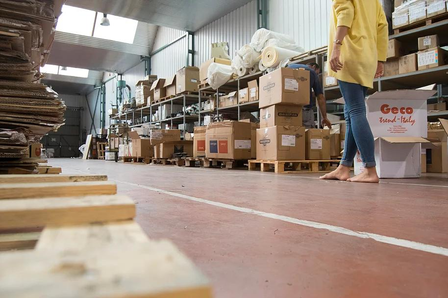
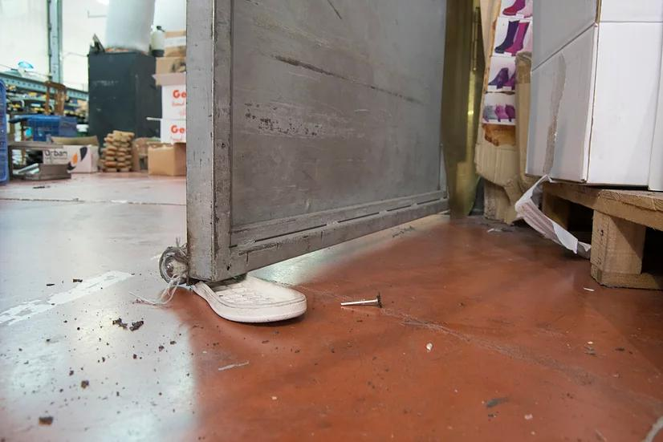
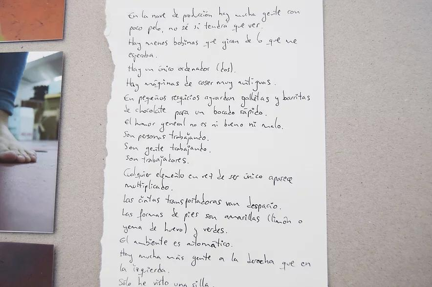
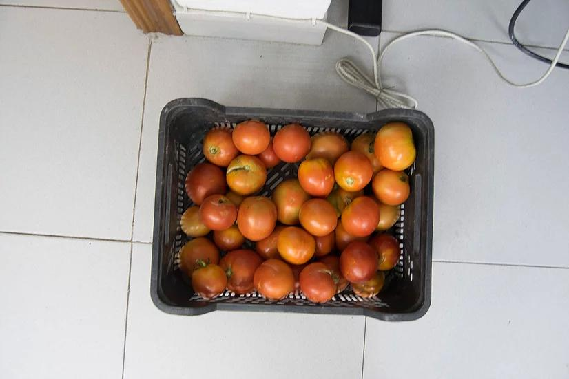
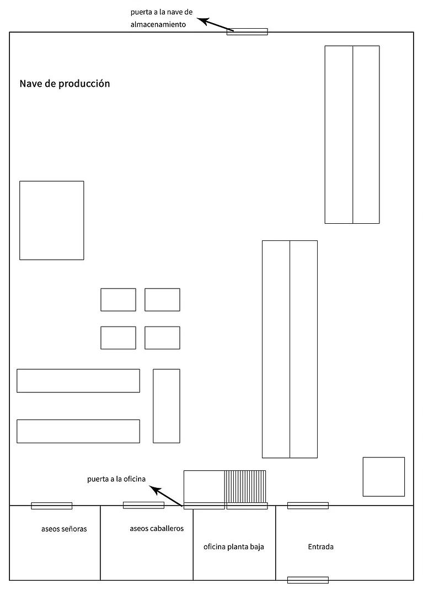

Considero necesario experimentar con los distintos roles que nos componen, los cuales se ajustan a las distintas exigencias sociales, políticas y económicas. En el entorno paradigmático de la fábrica, donde respondemos al genérico trabajador, decido explorar la individualidad, la inutilidad, la diferencia, etc.

