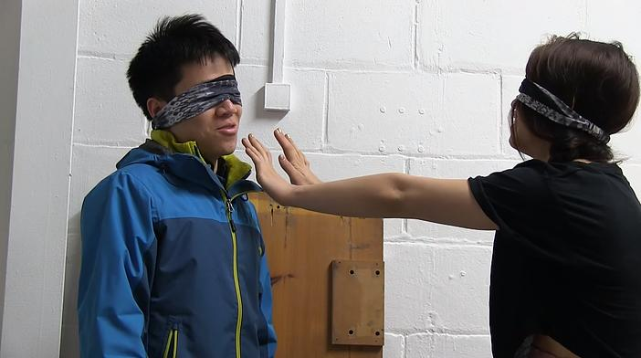
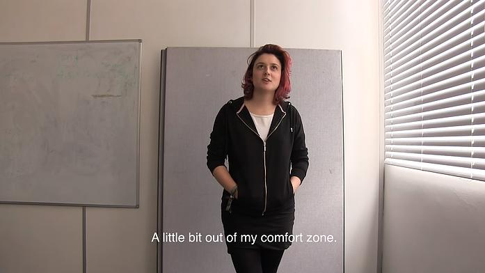
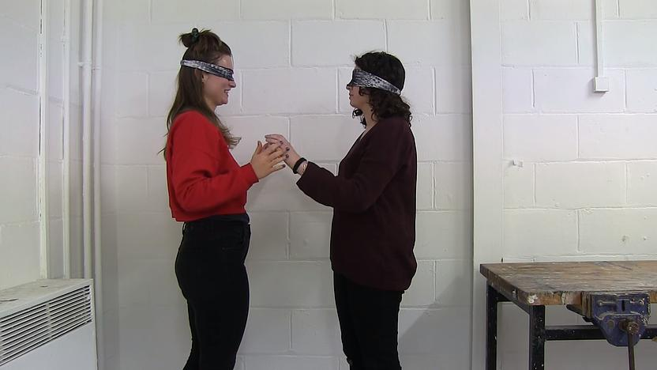
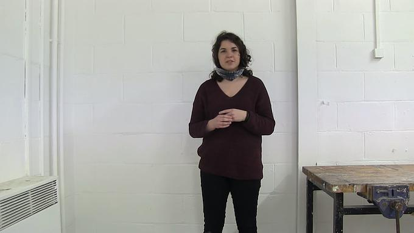
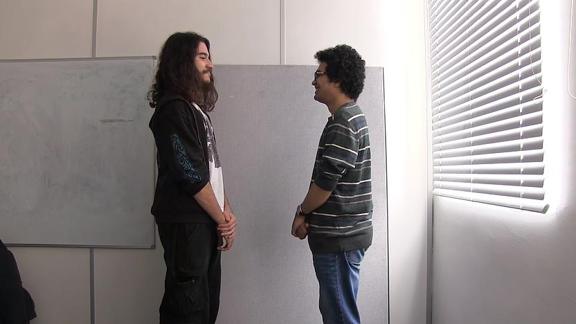
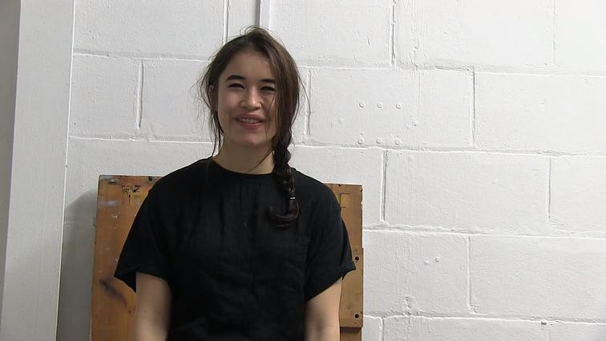
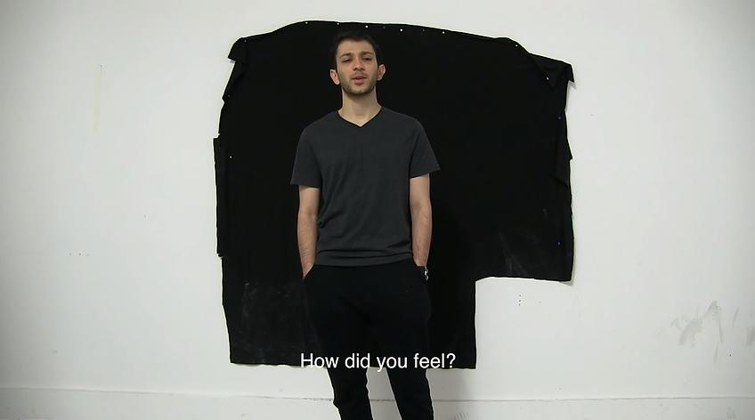
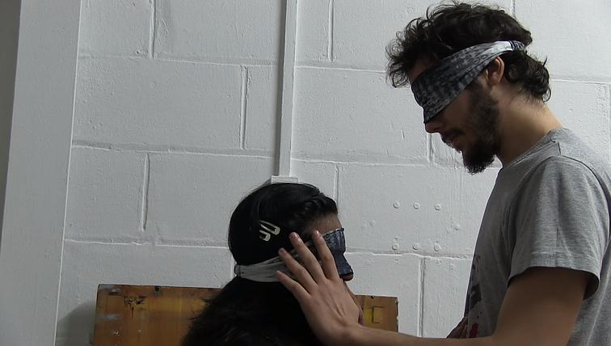
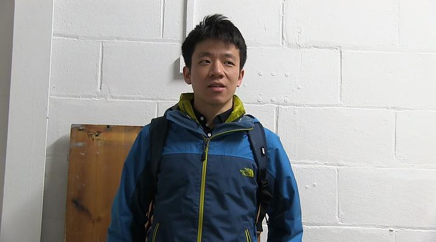
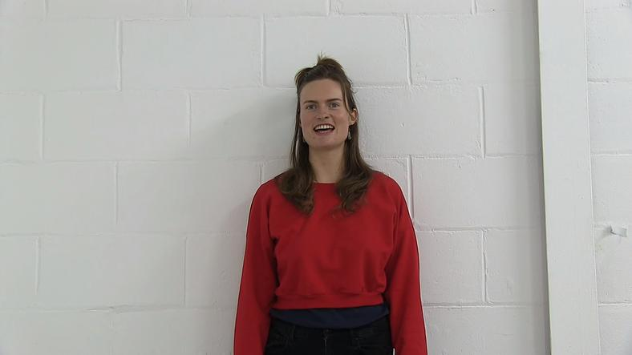

¿Cómo te has sentido? ¿Cómo crees que se ha sentido la otra persona? ¿Os habéis tocado? Tras esta experiencia, ¿crees poder decir algo sobre la otra persona?    ¿Puedes comparar esta experiencia con alguna otra?    ¿Has echado de menos poder hablar?    ¿Crees que el lenguaje origina contactos superficiales?    ¿Puedes ponerme un ejemplo?    ¿Alguna vez has sentido la necesidad de contacto físico y has tenido vergüenza de pedirlo?    ¿Has concebido el contacto como algo invasivo o comunicativo?    ¿Sueles contener tus sentimientos?    ¿Qué sensación has ganado con esta forma de conocer?    Una palabra que englobe el momento.    ¿Querrías conocer más a la otra persona?    ¿Habrías estado por más tiempo?    ¿Has concebido tus sentidos de manera distinta?    ¿Te consideras una persona tímida al conocer a los demás?    Cuando conoces a alguien, ¿crees que vas a ser juzgada?    ¿Qué haría falta para sentirte relajada a la hora de conocer a otra persona?    ¿Algún otro comentario?    Muchas gracias.

