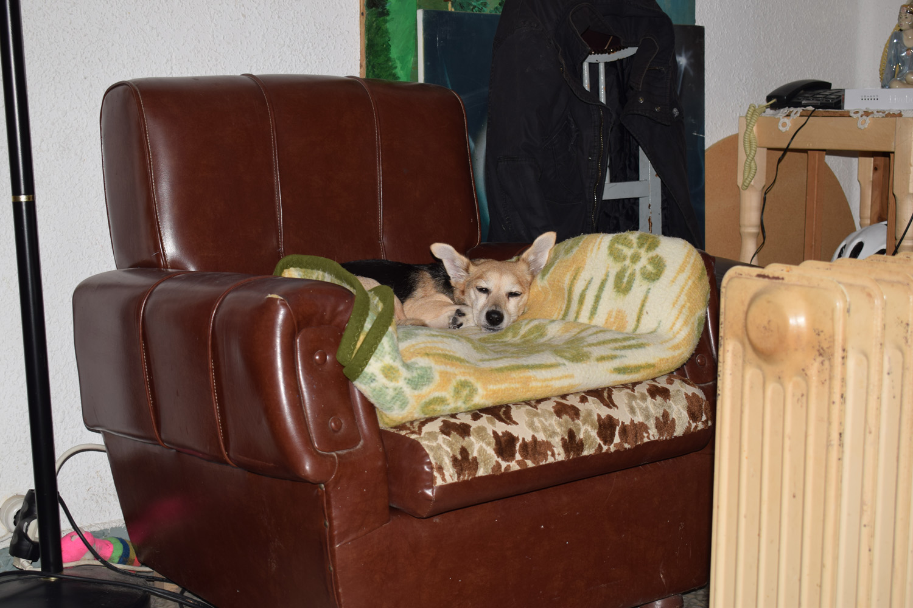
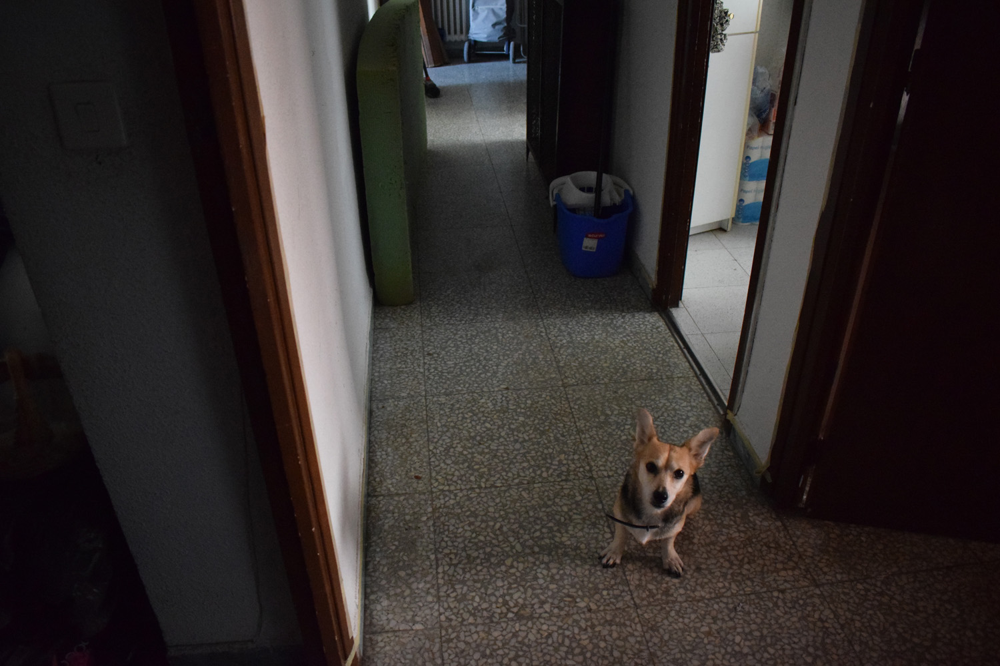
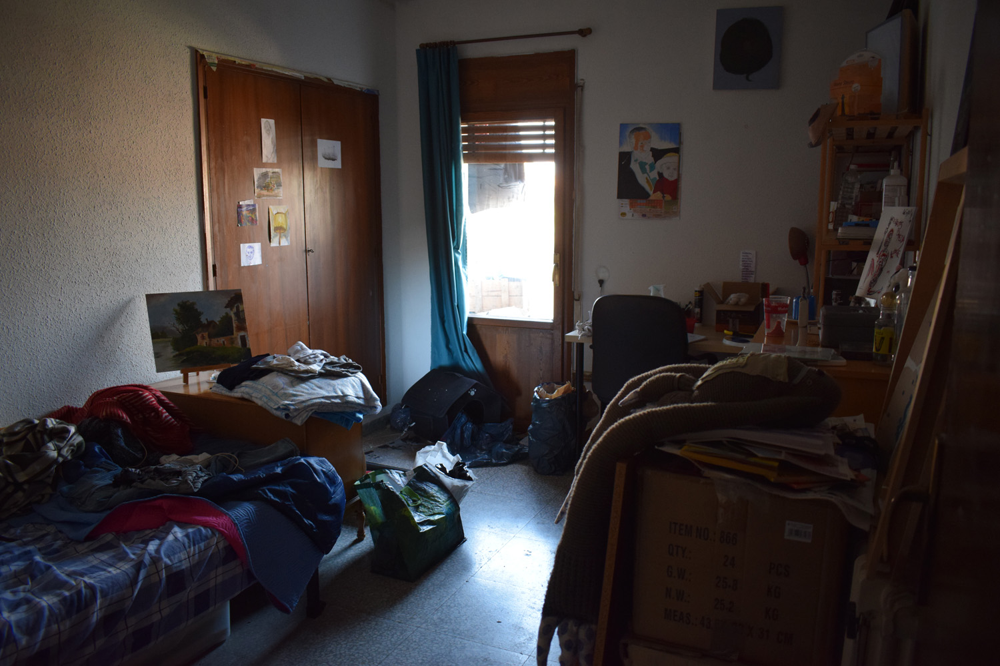
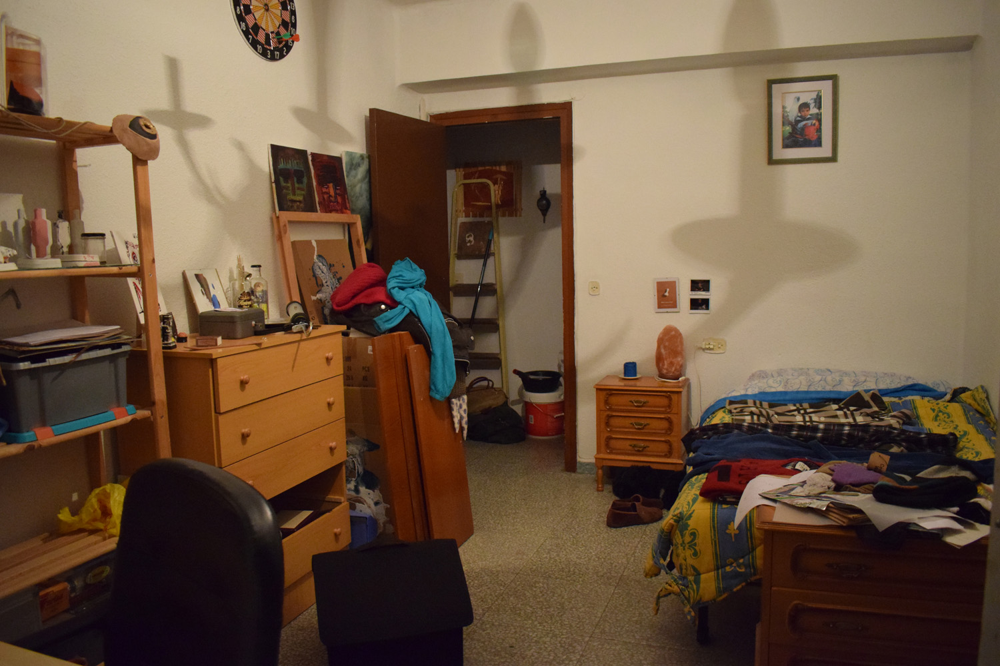
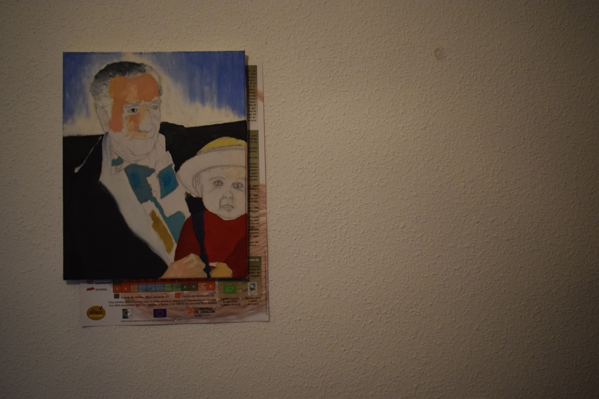
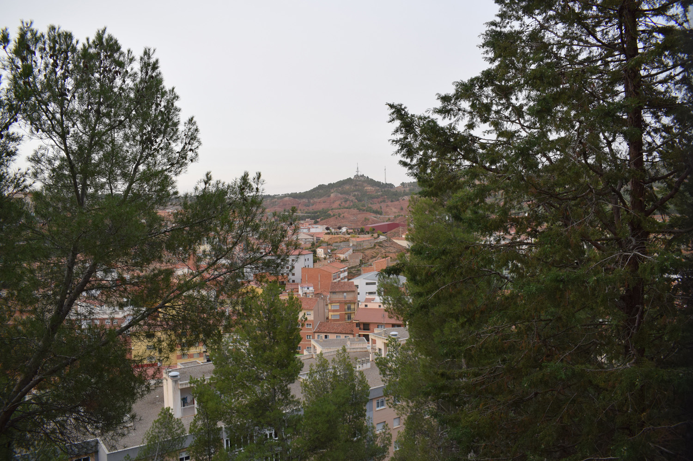
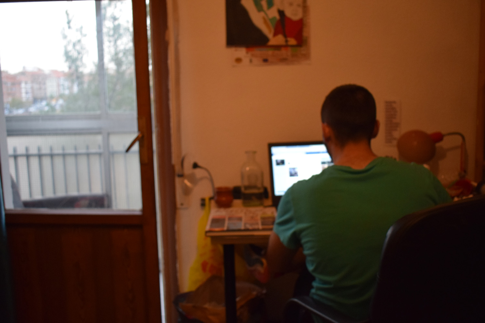

_Tuve la idea de vivir durante una temporada en la habitación de alguien más, de un otro, sin tener acceso a mis propias cosas. Intenté contactar a varios voluntarios hasta que di con Alberto._

Con la colaboración de Alberto Martínez.

---

Carla I

Carla II

Desde fuera, al entrar

Desde dentro, al salir

Alberto y su abuelo

Desde el sillón de la terraza

Alberto de visita

