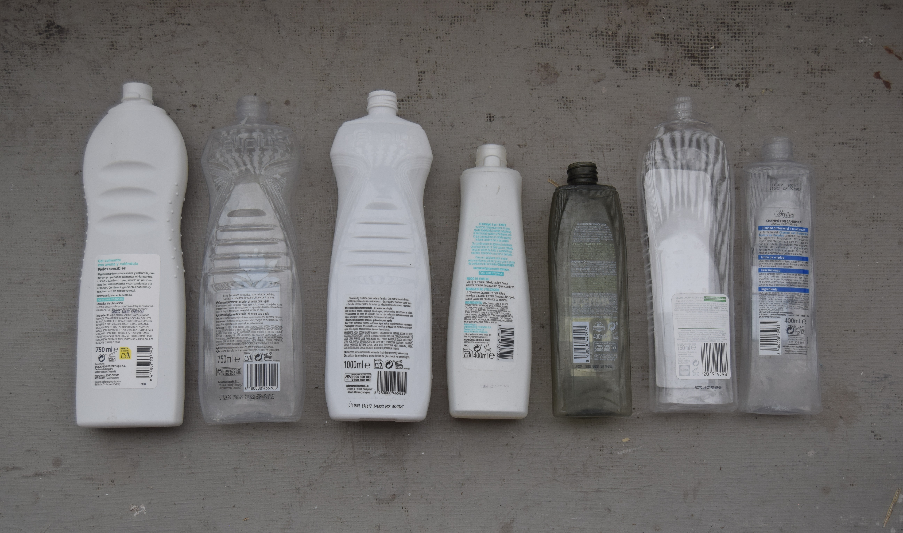
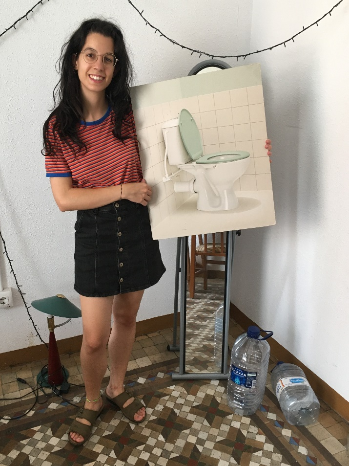
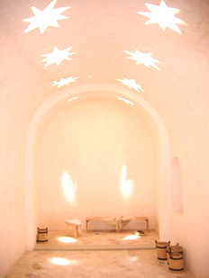

_Baños sin fronteras_ son tres vídeos en torno a los cuales se activan acontecimientos. Su concepción deriva de un planteamiento del baño como un lugar tan público y compartido como privado e individual. El baño, que solemos utilizar de forma individualizada, esconde un halo de universalidad común a los baños en todo el mundo y en la historia, puesto que en ellos realizamos las mismas tareas de limpieza y de alivio que antaño y que en el resto del mundo. Tareas que, además, durante mucho tiempo fueron una actividad compartida.

Esta especie de anonimato logra envolvernos e implicarnos, configurando el todo del que participamos y representando una posible unión de formas de vida que rebasa cualquier concepción antropocéntrica.

Tras conocer en Valencia los baños del Almirante, construidos en época cristiana pero inspirados en los baños de vapor árabes, que a su vez son herederos de las termas romanas, visualicé en ellos la dificultosa unión de culturas. Es importante recalcar que estos baños tenían un marcado carácter civil, se consideraban públicos y eran un espacio de encuentro, lo que les mantuvo activos durante largos siglos.

---

_Hermanas y compañeras_ 3’07” Dedicado a Mijo Miquel

_Persona, río, murciélago_ 4’37”

_Somos_ 4’07”

Jabón casero de oliva con aroma a romero y lavanda

Etiquetas de geles industriales

Retrato con retrete

_Orinas de mis amigas y amigos. 14/03/20-27/03/20_

_Baños del Almirante. Valencia_

<http://banysalmirall.gva.es>
