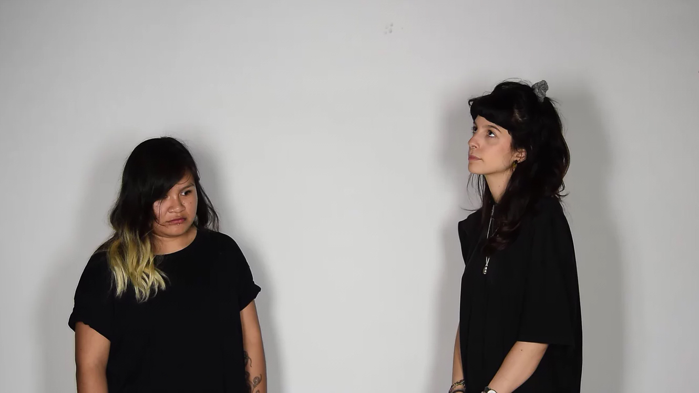

Tierra, maíz, madre, colonialismo, rojo, diferencia, España, conquista, libertad, espíritu, viaje, agua, amor, cultura, inmigrante, México, futuro, caricia, orgullo, prejuicio, belleza, infancia...

¿Cómo se ha construido mi identidad por haber nacido en un territorio determinado?