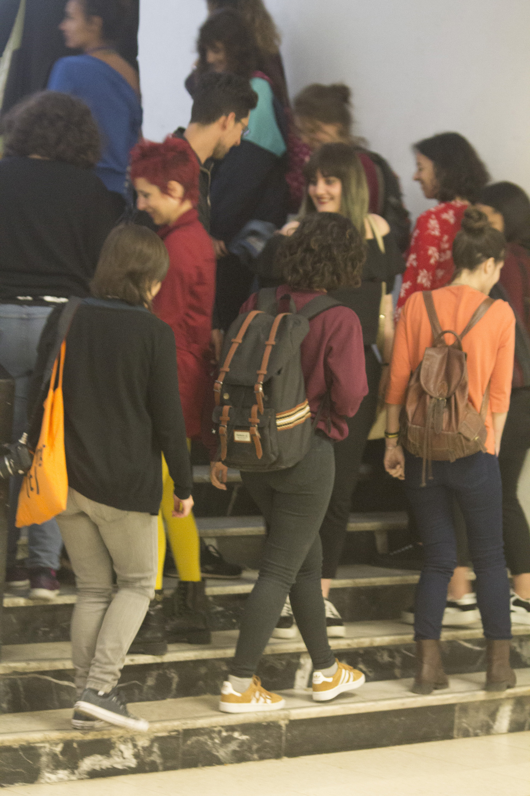
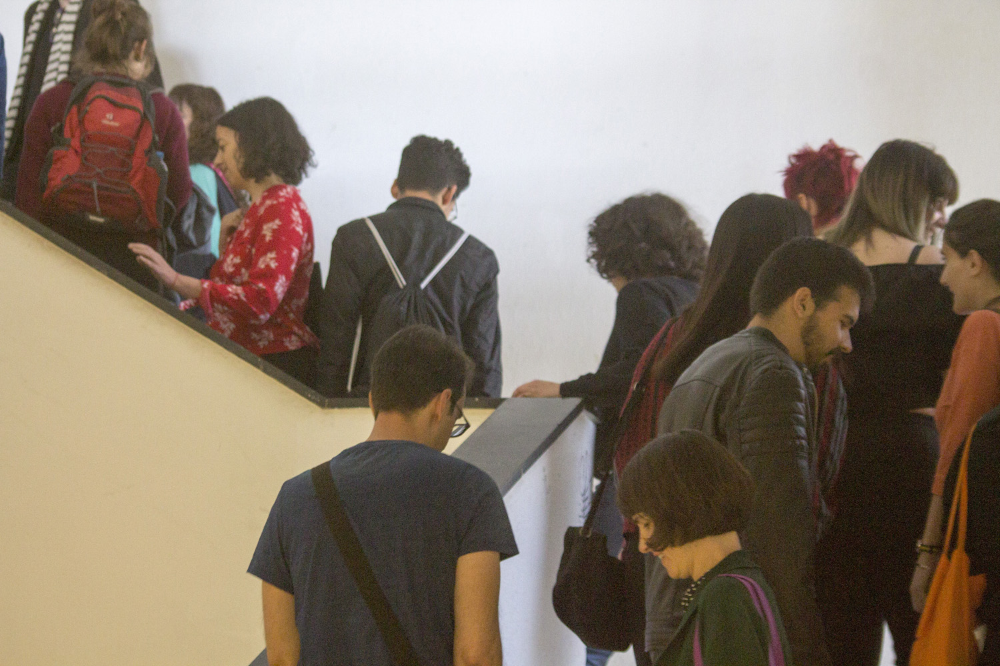
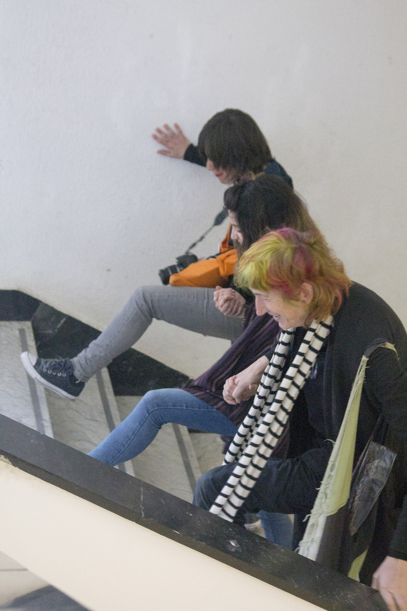
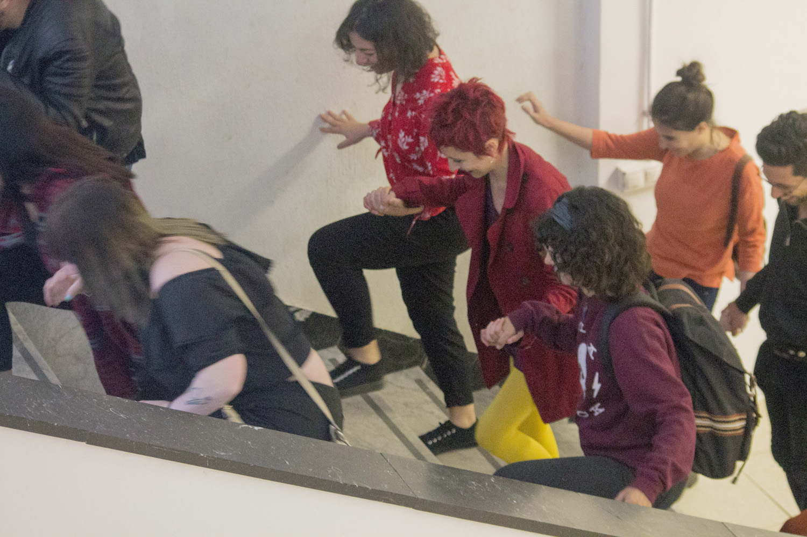
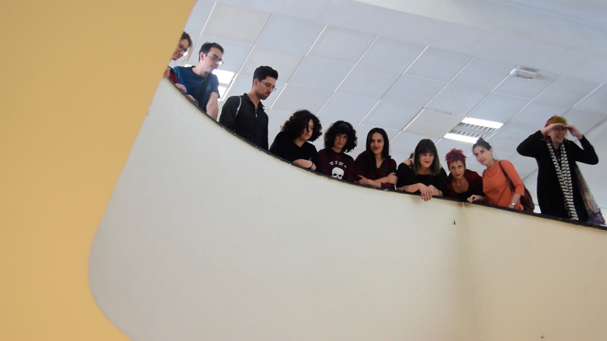
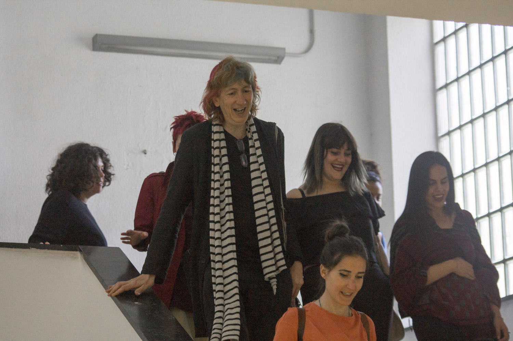
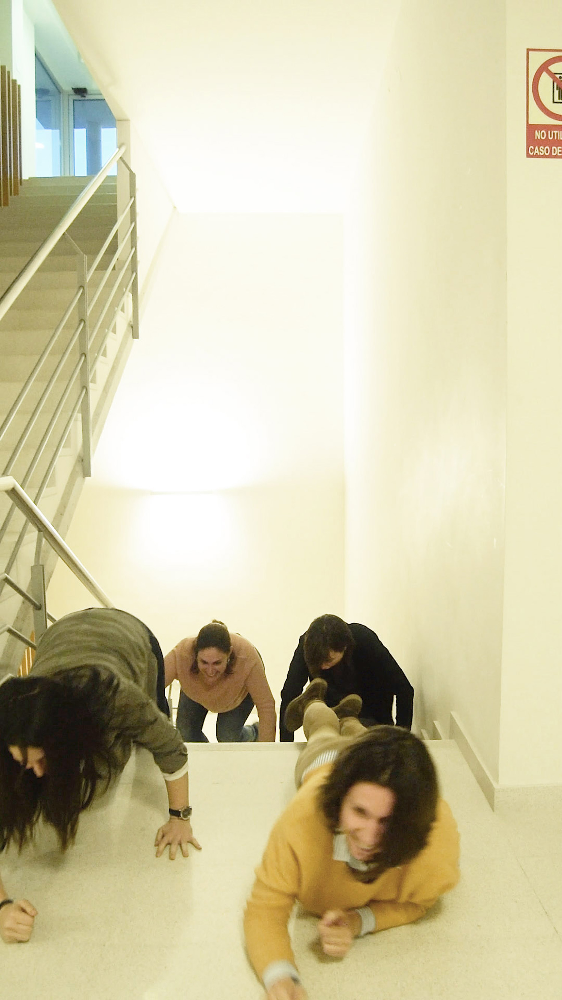

Muchas de nuestras acciones más cotidianas han sido interiorizadas como normas sobre las que no hay opción al diálogo o a la reflexión, como son el comportamiento esperable en una mesa a la hora de comer, en un aula, en la calle… Sin embargo, todo esto tiene su origen en unos valores u objetivos que en esta performance grupal se repensaron para decidirlos de nuevo colectivamente.

Centradas en la acción de subir y bajar las escaleras, las participantes acordamos una nueva coreografía transformando así el plano del encuentro social, el uso del cuerpo en público, el contacto, el espacio, etc.

_

II Congreso de Artes de Acción de la UCM, Acción Spring(t).
Bellas Artes.
Madrid.

---

_Fotografías de Carmen Mendoza Losada_

_Primer intento junto a María, Ruth, Pilar y Alba_
