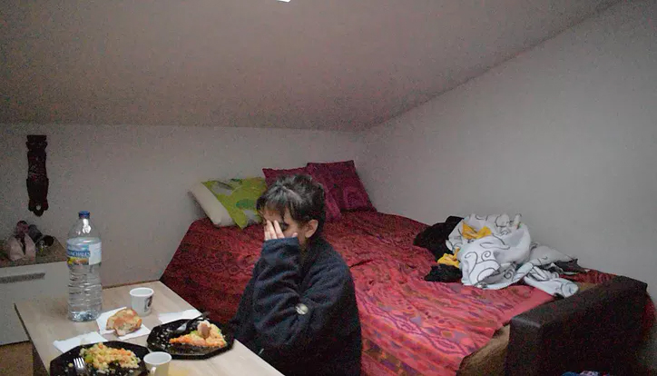
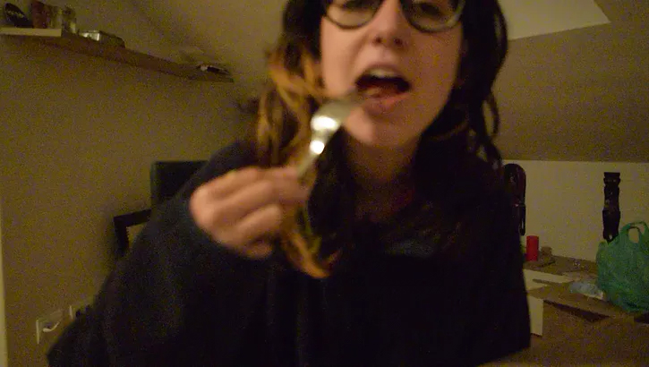
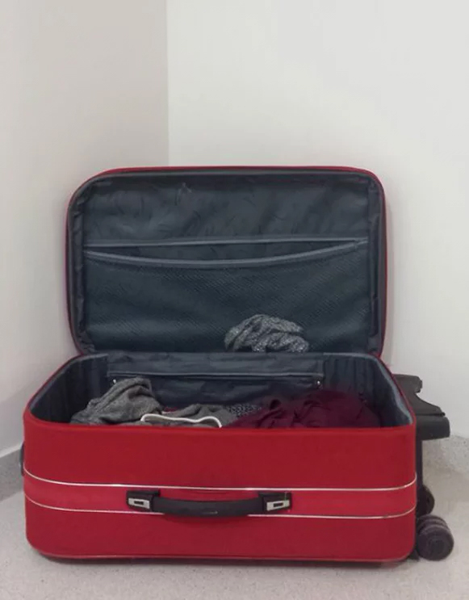
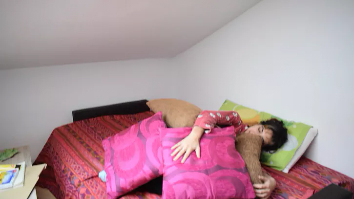
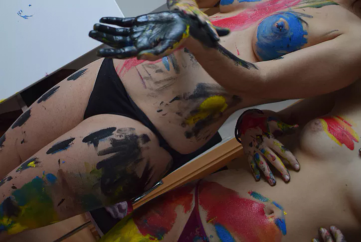

Levantarse de la cama, usar el baño, volver a la cama. Acariciar a Anapi, observar la luz. No pensar en nada, no aburrirse, no excitarse. Oler y observar con impasibilidad, como respirar. Silvia ha alcanzado la segunda mañana del experimento y algo parece aflojarse dentro de ella. Tumbada en la cama se siente tan floja que no puede confundirse con el alivio. Está bien, sentimiento de normalidad. Se siente mucho más cansada que de costumbre, como si su cuerpo comprendiera tanta desconexión.

