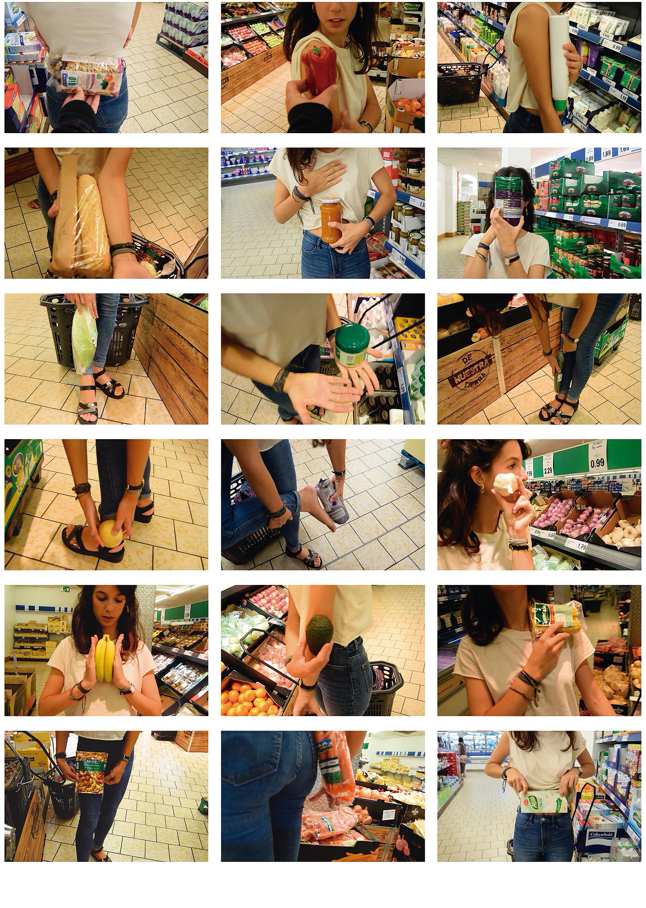

Pensé la posmodernidad y su regreso a las minorías y singularidades (...), cuyas diferentes realidades son habladas siempre en relación a, relativas a algo como intersubjetividad, comprendiendo que la verdad es sólo una afirmación sobre las cosas y nunca las cosas mismas (...)

Este renovado interés por el cuerpo y las tradiciones me lleva a plantear un sistema económico donde nuestra subjetividad sea una herramienta válida y las ficciones de homogeneidad como el dinero no tengan lugar.

