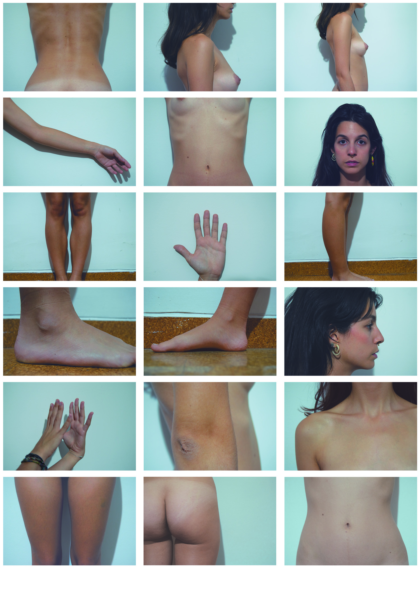
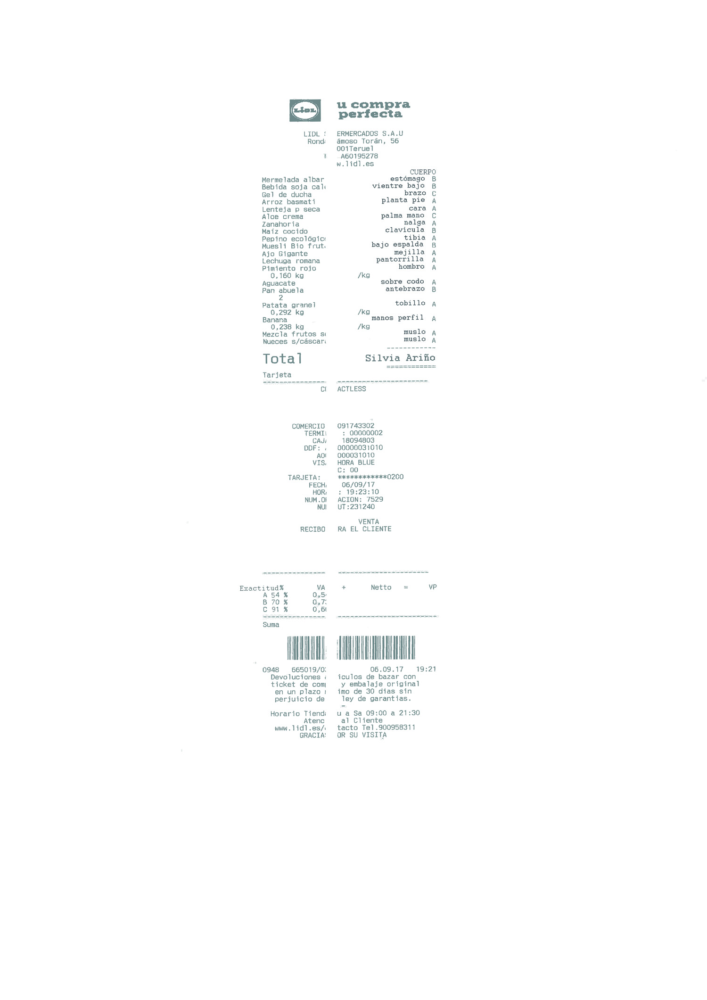

El sociólogo Michel Maffesoli afirma que a grades épocas racionalistas le suceden sin ningún esfuerzo grandes momentos sensualistas, y partiendo de este enunciado decido trabajar un nuevo sistema económico que suceda al neoliberalismo. Las bases sobre las que se asienta nuestra economía niegan las diferencias y especificidades de los individuos en nombre de una visión única del ser humano. Sin embargo, justamente se aprovecha de estas diferencias estructurales para generar un beneficio en sus vínculos y lograr imponerse a otras culturas en relación de subordinación. Por todo ello, propongo un sistema que esté más relacionado con lo particular que con lo universal y la falsa objetividad.

Esta propuesta económica trabaja por comprender que nada puede separarse de su contexto. Pretende utilizar a la olvidada carne en su proceso, además de que no concluye en absoluto en una homogenización ficcional como la del dinero, sino que cada uno usa la herramienta propia de su cuerpo. 

_

*PAM!19.* Comisariada por el Máster Interuniversitario en Gestión Cultural (UPV-UV) y el Máster Universitario en Producción Artística (UPV).

_Todo podría ser de otra manera: estudio de casos_ FCSH. Teruel.

---

