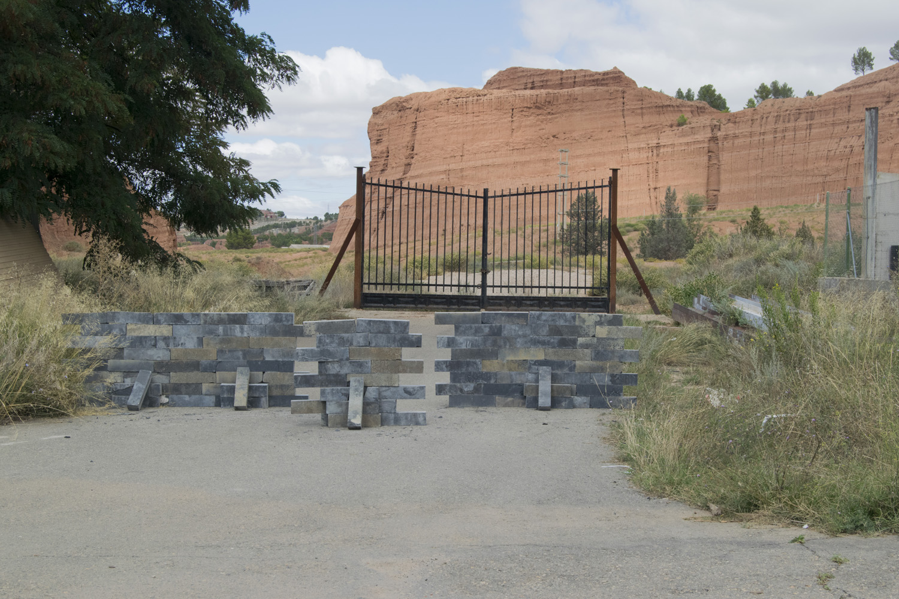

Intervención con ladrillos encontrados.

Considero que los seres humanos vamos a estar en continuo cambio de dispositivos de entendimiento de la realidad, pero que no vamos a poder “liberarnos” de la necesidad de lógica y sentido, de un dispositivo en el cual y a través del cual vivir (...).

Si destruimos todos los ladrillos, todos los dispositivos, ¿qué queda del muro, qué queda del ser humano?

---

