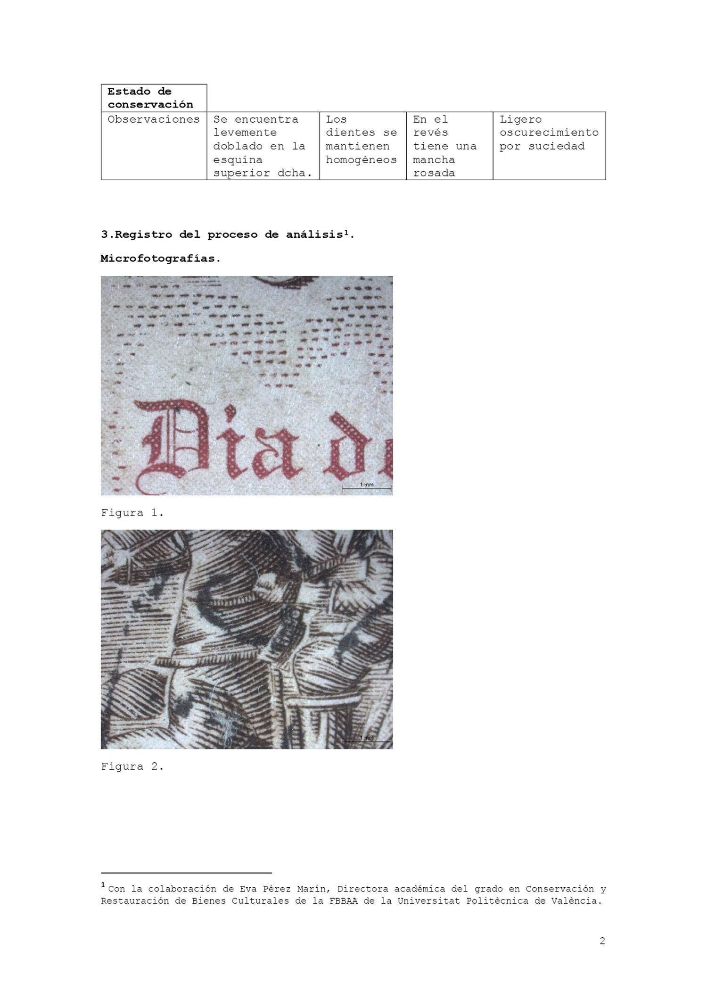
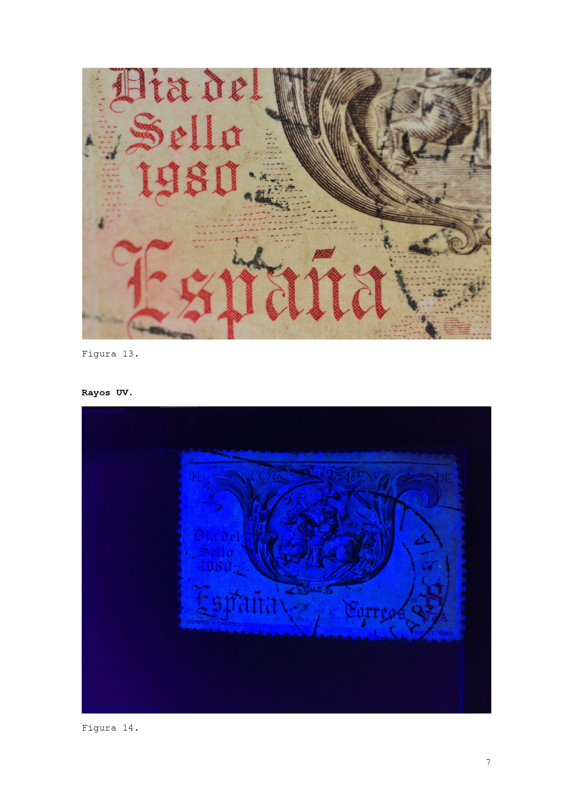

Este proyecto ha realizado la tarea de recuperación de un sello antiguo y usado que, frente a su apariencia de resto, mediante su contextualización se revela a sí mismo como rico en historia y matices.

_

Mención especial en _Mail Me Art_. Circular Society Lab.

---

