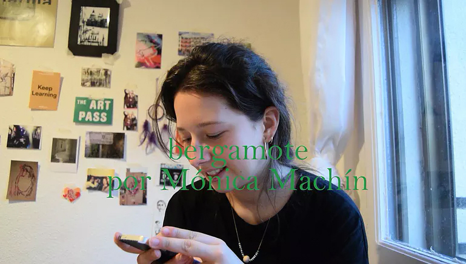
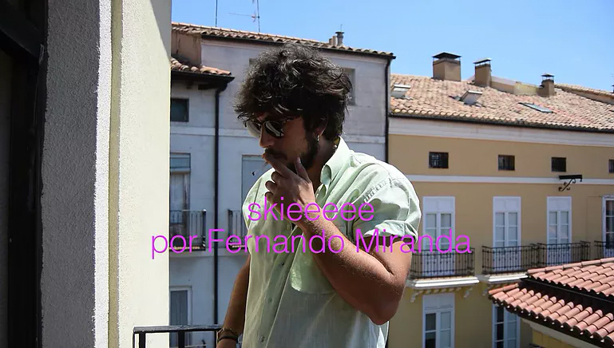
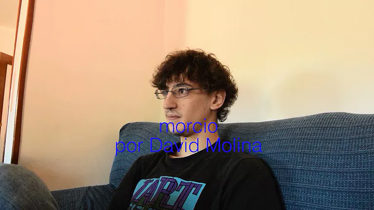
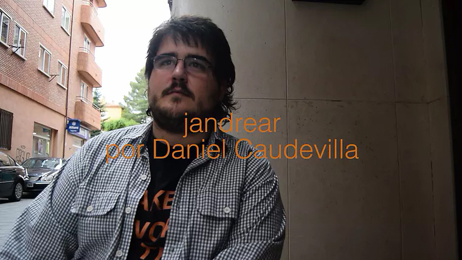

Este diccionario audiovisual (todavía en construcción) parte de los hablantes para tratar de definir palabras inventadas o resignificadas, concibiéndolas como alternativas a los habituales usos del lenguaje.

Con estos términos no sabemos dónde empieza y dónde acaba la referencia de la realidad acostumbrada y de una realidad totalmente nueva, es un juego en la ambigüedad de las fronteras.

