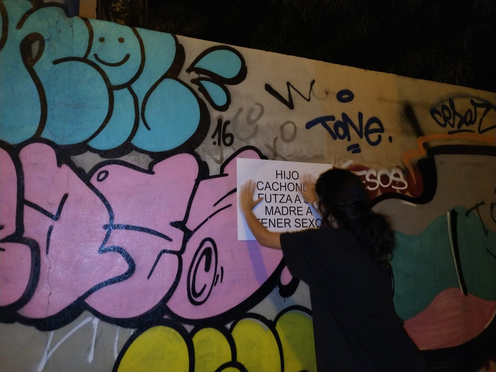
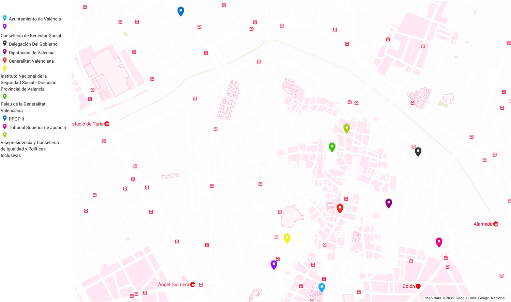

Con esta acción se quiere señalar los actos e imaginarios machistas y violentos que en nuestros días sólo son aceptados de forma explícita en la pornografía, puesto que su expresión en cualquier otro contexto nos provoca rechazo y condena, además de un fuerte sentimiento de injusticia. Para ello, una selección de títulos de vídeos porno populares es sacada a la calle, colocándolos en diálogo con las ciudadanas y ciudadanos y con las instituciones públicas que se declaran defensoras de la igualdad de género.

El trasfondo patriarcal de estos vídeos refleja una apología del uso sexual de las mujeres, un desprecio por su sexualidad y sus deseos y las relega al eterno plano de la inferioridad de quien está al servicio del placer de los otros. 

Con la colaboración de Carmen Arilla.

_

_Ciudad desheredada_. Exposición de artistas emergentes.
Comisariada por Silvia Ariño y Ana Orcal como colaboradoras de PMAC.
FCSH de Teruel.

---

_Documento fotográfico_

Antecedentes. _La entrega de la dignidad (2019)_ 2’24” Con la colaboración de Marc Mariné

