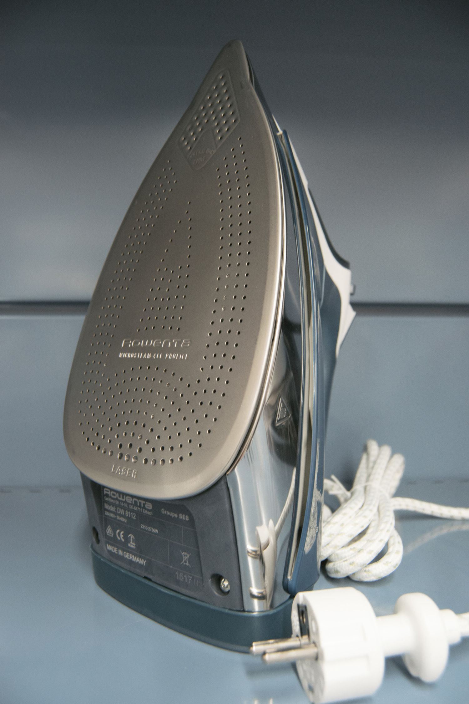

En este proyecto escojo el elemento de la plancha de ropa y decido atribuirlo a una posible correspondencia con nuestro rostro y cabeza. El objeto en sí tiene una gran significación, ya que se establece entre lo útil y lo inútil, se retrata como uno de los elementos más icónicos de un tipo de civilización (...).

Este reflejo o correspondencia habla de la plancha como representación de lo útil dentro de determinadas valoraciones de la utilidad y de nuestra representación de la humanidad dentro de determinadas valoraciones de lo humano.

_

_Garbo Festival_. Palacio de Exposiciones y Congresos de Teruel.

---

Andrea Machuca

Ana García-Carpintero

Alba Baucells

Paloma Sánchez

Roberto Navarro

Fernando Miranda

Victoria Pérez

Lillian Ling

Jorge García Ubalde

Carmen Lizandra

Alberto Pinilla

Pilar Gimeno
