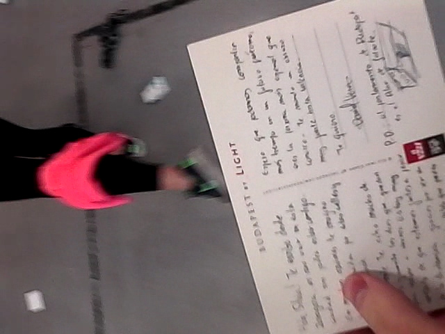
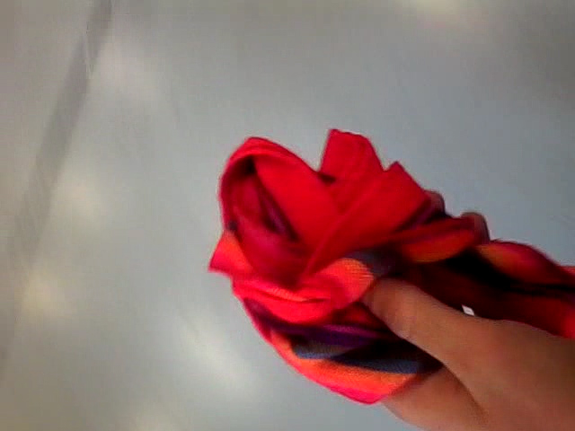
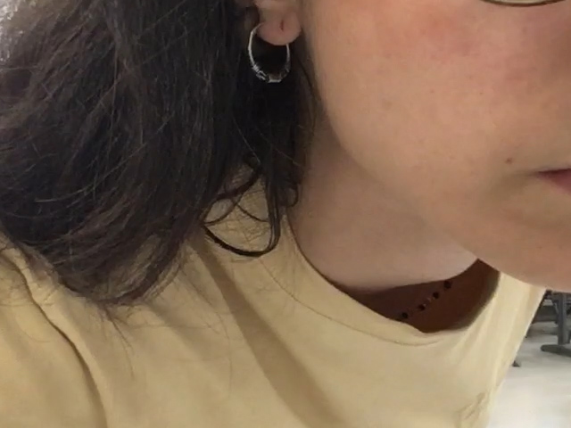

Esta pieza fue pensada como un ensayo breve que pretendía señalar la otra cara de los objetos y la cotidianidad.

Desde el pasado siglo el arte ha reivindicado como un lugar propio el valor y el interés que pueden tener los objetos que nos rodean. Sin embargo, esta perspectiva, apolítica en sus análisis de lo doméstico, olvida el peso y el significado que lo doméstico y lo cotidiano ha supuesto para las mujeres en nuestra sociedad.

Con la colaboración de David Ábalos Aliaga.

_

_I Muestra Internacional de Arte Contemporáneo realizado por Mujeres_.
Plataforma de Mujeres en el Arte Contemporáneo (PMAC).
IAACC Pablo Serrano.
Zaragoza.

---

_Mujer mesa_

3’40”

