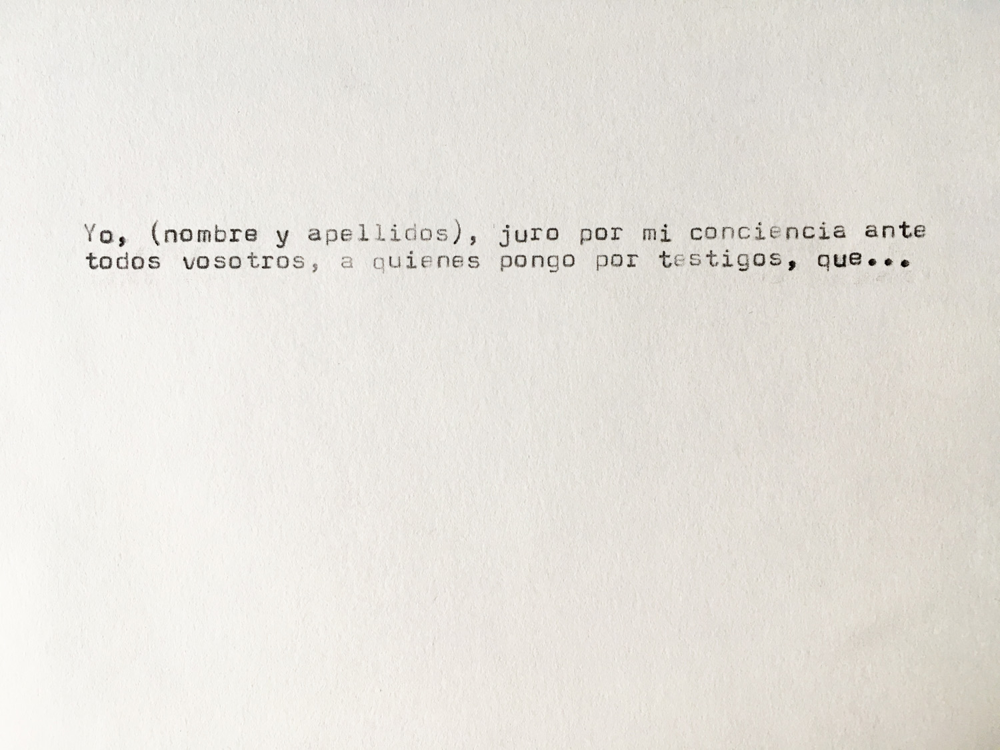
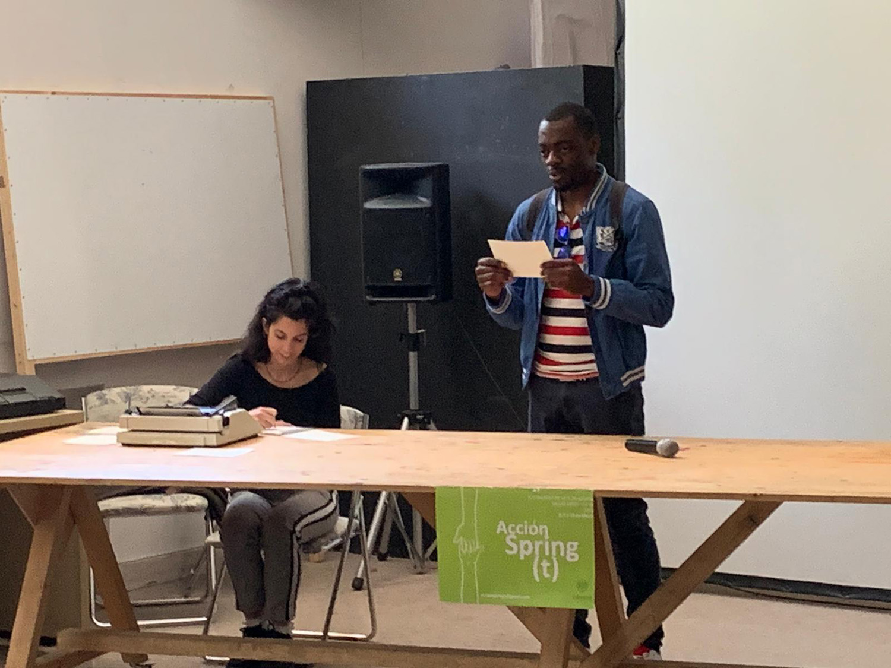
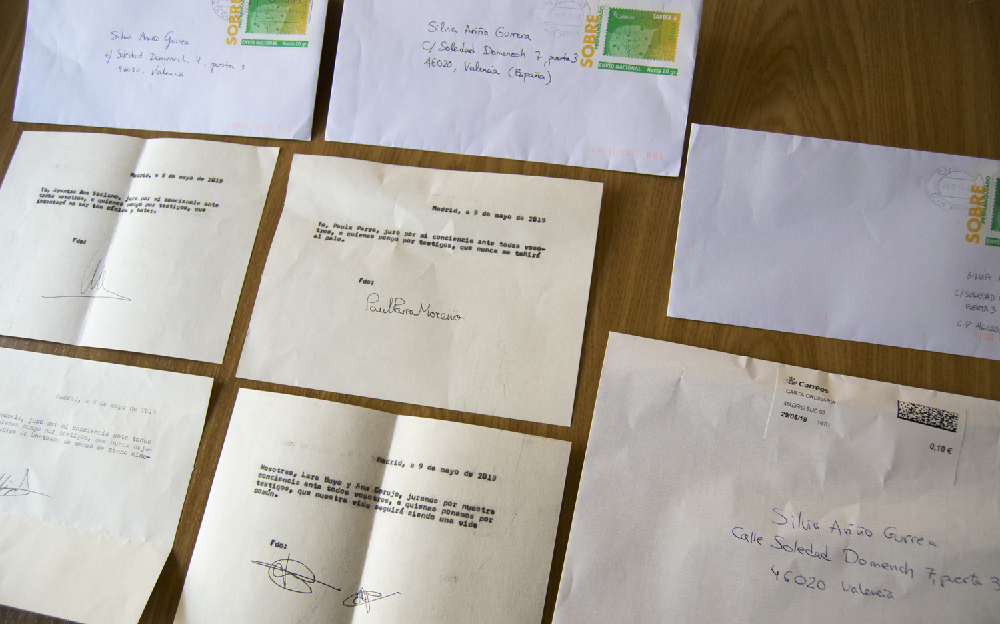

Propuesta abierta de juramentos en público en la que la solemnidad y ceremoniosidad intrínsecas a un juramento nos recuerdan que las palabras no son vacías, ni son meros vehículos ni reflejos, sino que conforman nuestro soporte del mundo, son nuestra osamenta. 

_

III Congreso de Artes de Acción de la UCM, Acción Spring(t).
Bellas Artes.
Madrid.

---

_Fórmula del juramento_

 

_Momento del acto_

_Certificados firmados_

__

_Madrid, 9 de mayo de 2019_

_Yo, Silvia Ariño Gurrea, juro por mi conciencia ante todos vosotros, a quienes pongo por testigos, que a partir de hoy hasta cumplir un mes, dedicaré diez minutos al día a observar el vuelo de una mosca y reflexionar en torno a alguna cuestión sobre la que no tenga poder de actuación ni intervenga mi voluntad._