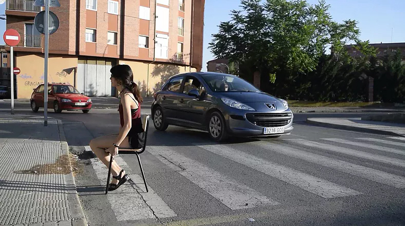

La actuación realizada en ¿Por qué existen las sillas incómodas? I busca relacionarnos con un sentido fuera de los códigos ajenos y previos a nosotros que nos han sido dados y son tan recientes, derivados del sistema liberal de mercado, el cual valora principalmente la funcionalidad y rendimiento máximo de las cosas y personas. Así, mediante un acto extraño, descontextualizado, ridículo, cansado, inútil, niego punto por punto las instrucciones para la utilización de la silla y el papel del usuario, el cual también incumplo. Trato de revisar la normalización que impide cualquier otra visión que podamos pretender desarrollar de la silla y de nosotros mismos.

En ¿Por qué existen las sillas incómodas? II trato de cuestionar por qué dotamos de tanto valor al orden si realmente su estructura perfecta siempre va a ser una ficción.

