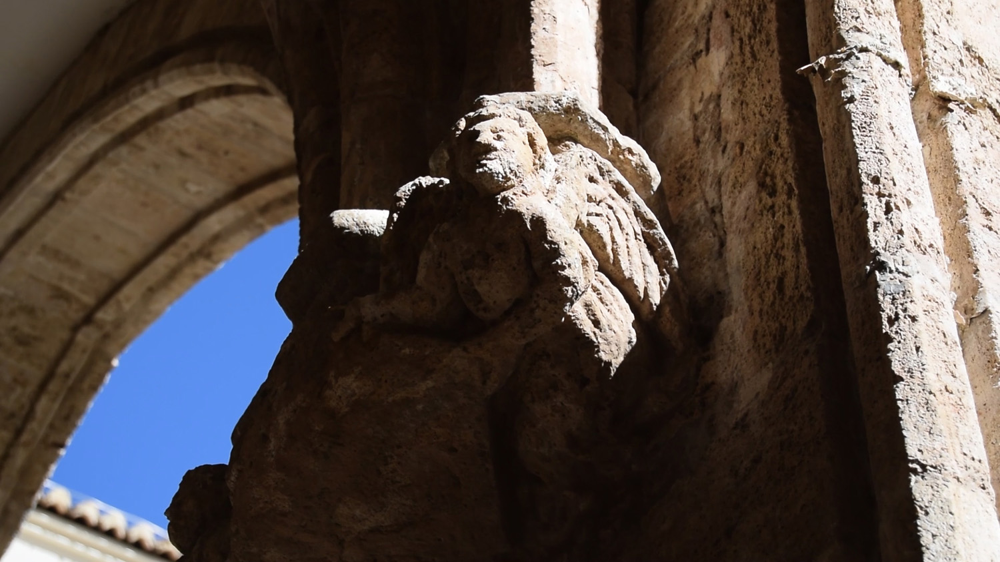
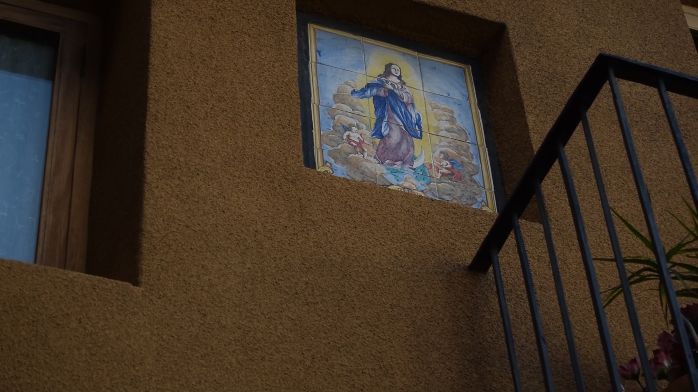
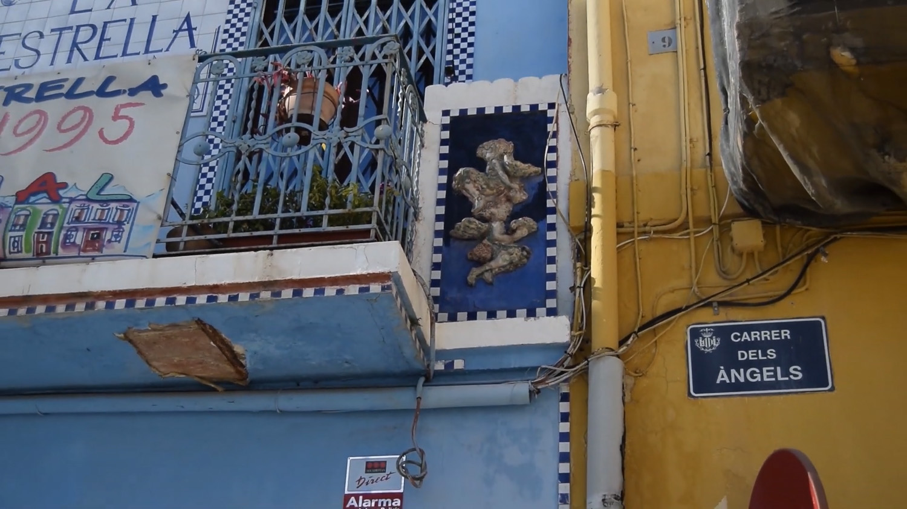
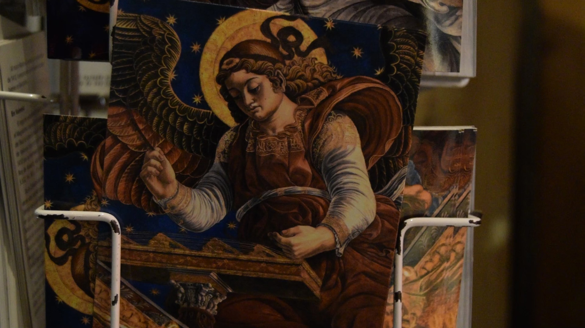
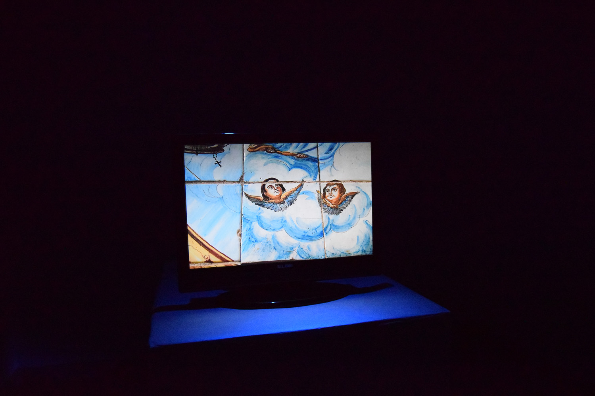
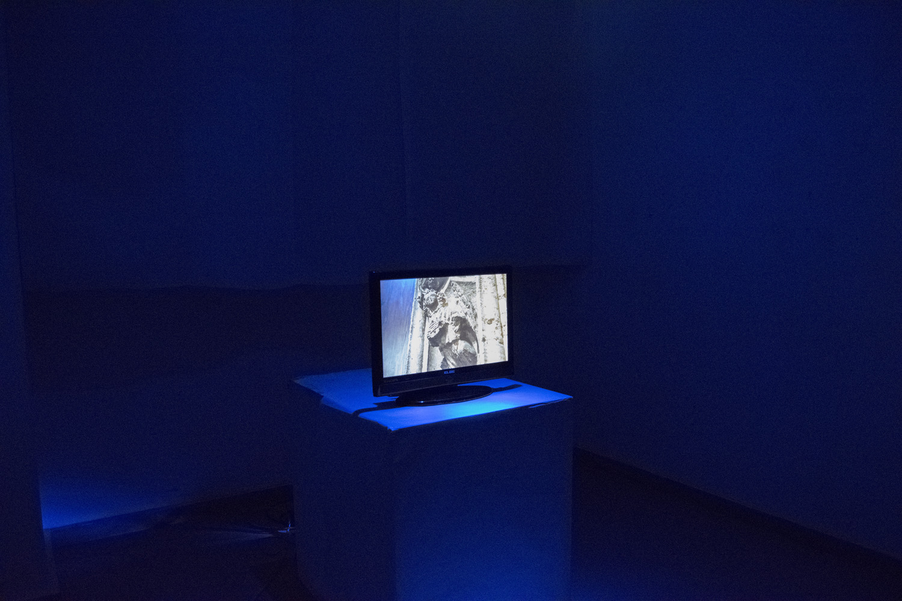

Este vídeo forma parte de una serie que se inicia al adquirir conciencia de la inspiración que suponen las personas que me rodean y que forman parte de mi vida, en general mis amigas y amigos. Por ello, y aunque indirectamente ya formen parte de mis trabajos, quise evidenciar este hecho mediante algunas piezas dedicadas a temas, sentimientos, ideas y emociones que hemos trabajado conjuntamente.

Nacho es poeta, y la figura del ángel siempre nos ha interesado discursivamente. Para nosotros representa una hibridación extraña, algo que se encuentra entre lo humano y lo divino, sin naturaleza propia. Ambos creemos que toda mezcla es atrayente porque nos obliga a repensar aquello que creíamos saber y a tratar de reestablecer sus límites. 

De este modo, podemos ver en la propia representación de lo humano algo igualmente extraño e inestable, algo que debido a nuestra efectiva materialidad nos sitúa en un estado más indefinido que el angelical. Por ello, en este trabajo se pretende reflexionar sobre la propia forma de ser y estar de los ángeles para obtener alguna respuesta sobre nuestro ser y estar en el mundo.

Dedicado a Ignacio Clavero.

---

_Un poema para Nacho_ 2’27”

