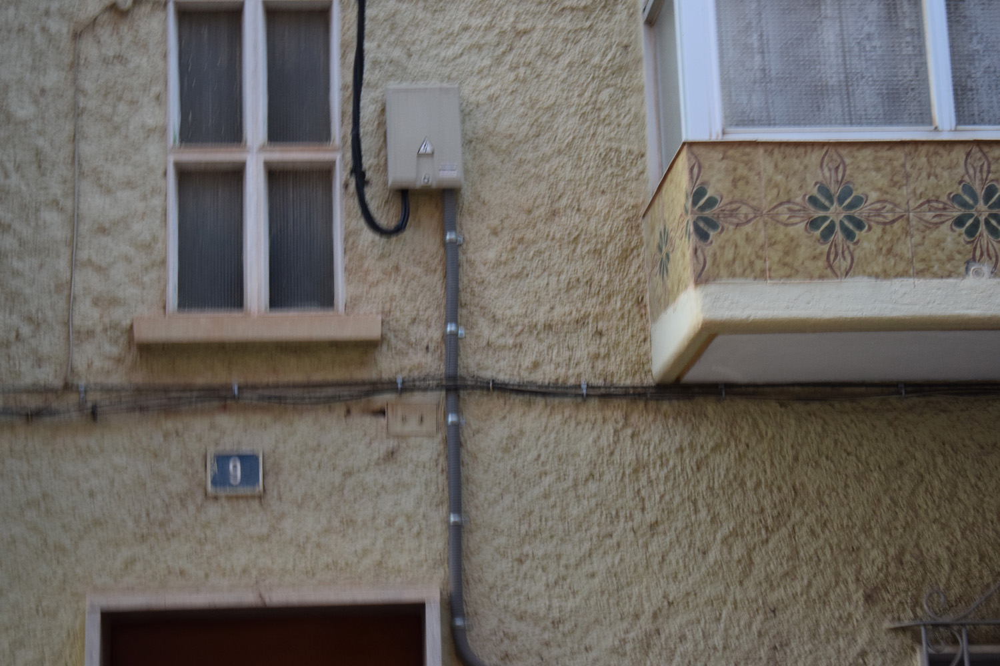

_Caminar como práctica de la voluntad._

Trato la cuestión de la existencia o no de la voluntad, planteándome la metáfora de la inevitabilidad de ir hacia delante en la decisión de caminar. Es decir, ante la irremediabilidad de vivir, sólo podemos caminar a la vez que vamos hacia delante. Ambas actitudes parecen pues convivir y por ello yo trato de reconciliarlas en el mismo paseo, realizando fotos conscientes a la par que otras inconscientes.

