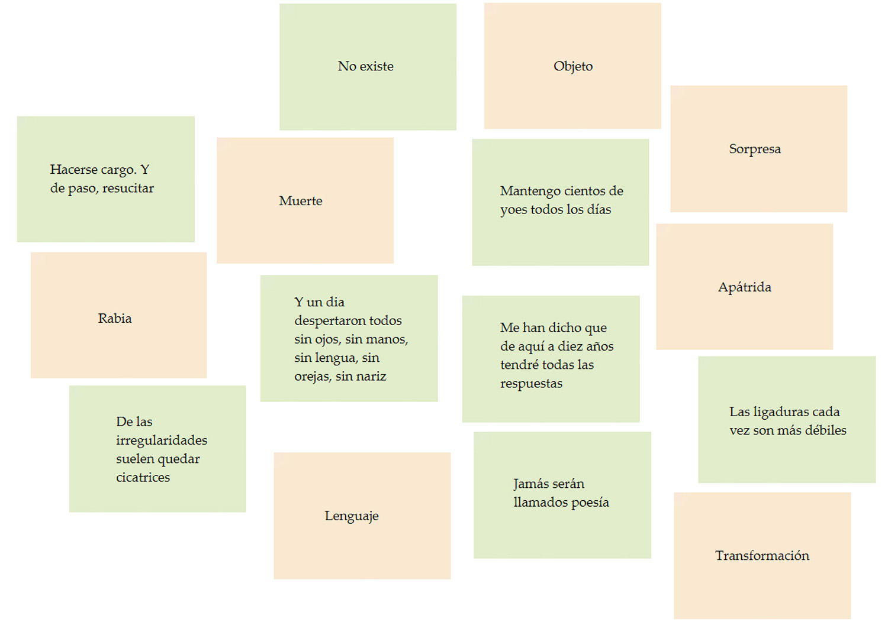
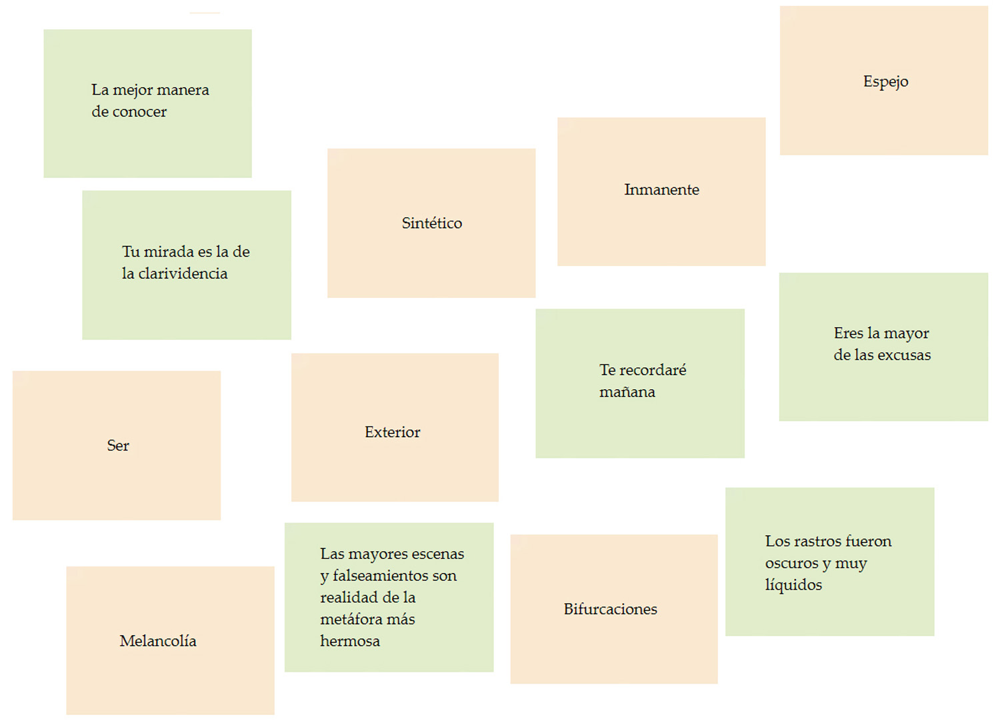

_Jugar a los orígenes._

 Reglas del juego:

Se extienden las cartas sobre una mesa común a todos los jugadores, quienes las cogen, leen y piensan. 
Hay que emparejar cada palabra con uno de los comentarios. 
El número de jugadores es ilimitado. 
El juego termina cuando todos los participantes están absolutamente de acuerdo con el emparejamiento de las cartas. 
Para llegar a emparejarlas se requiere del debate, del uso de más palabras para llegar a una resolución común. 
No hay respuestas falsas o verdaderas, no importa el mensaje de las cartas, sólo importan las alianzas que nuevos usos del lenguaje pueden crear. 
Jugar, hablar, abandonar, retomar, intercambiar, etc. tantas veces como se quiera. 
No hay restricciones por racionalidad o sentido. 

---

