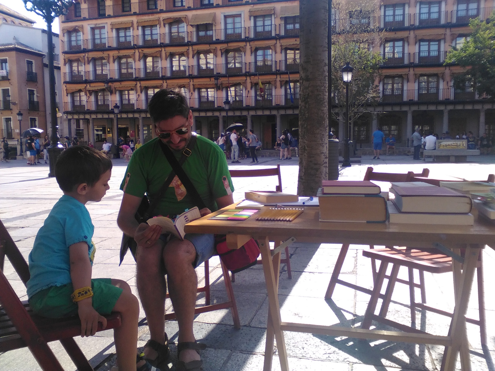
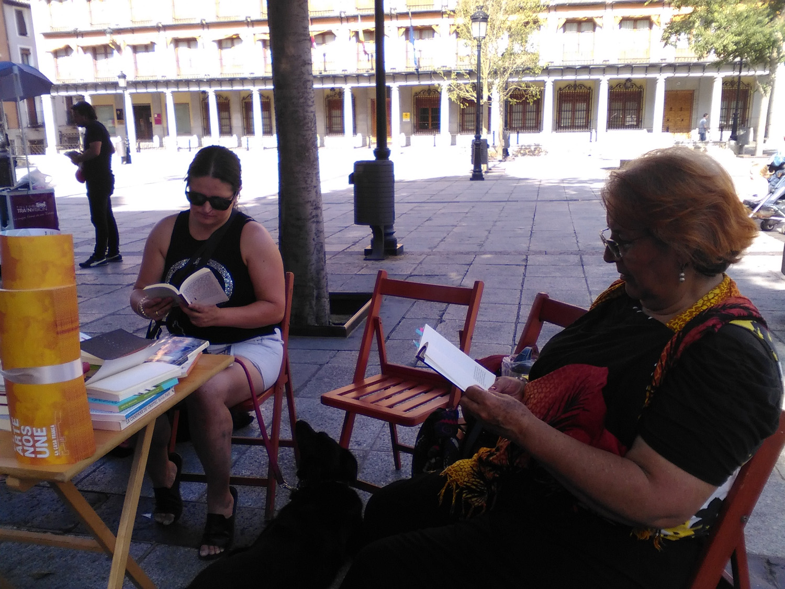
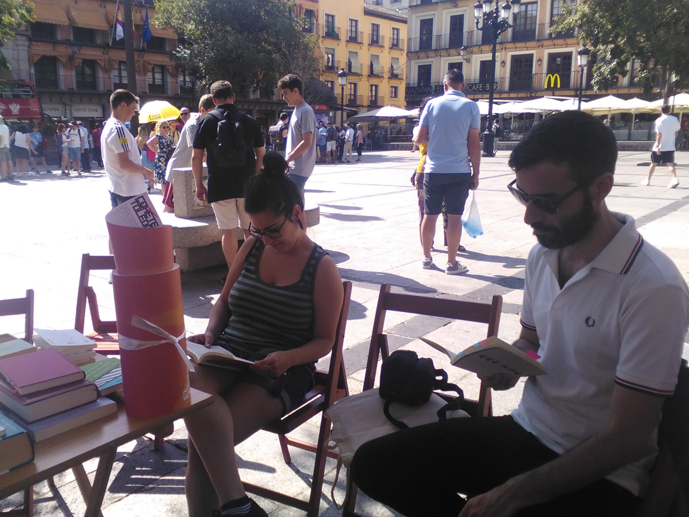
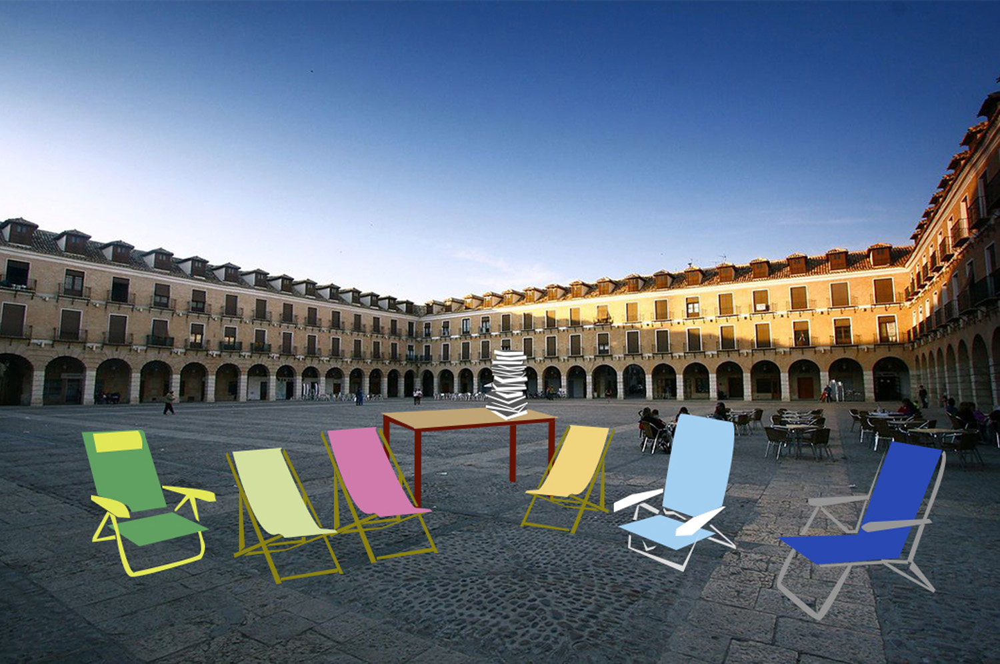

_Inteligencia contagiosa._ Cohete Toledo.

Antiguamente nos reuníamos en las calles para compartir ideas, razonamientos y creábamos espacios comunes de conversación. En la contemporaneidad, los lugares de conocimiento son forzosamente solitarios y nos vemos obligados a competir entre nosotros. Por ello, en este evento se propone la idea de que la inteligencia es contagiosa, no solitaria, invitando al público a compartir lecturas e ideas.

